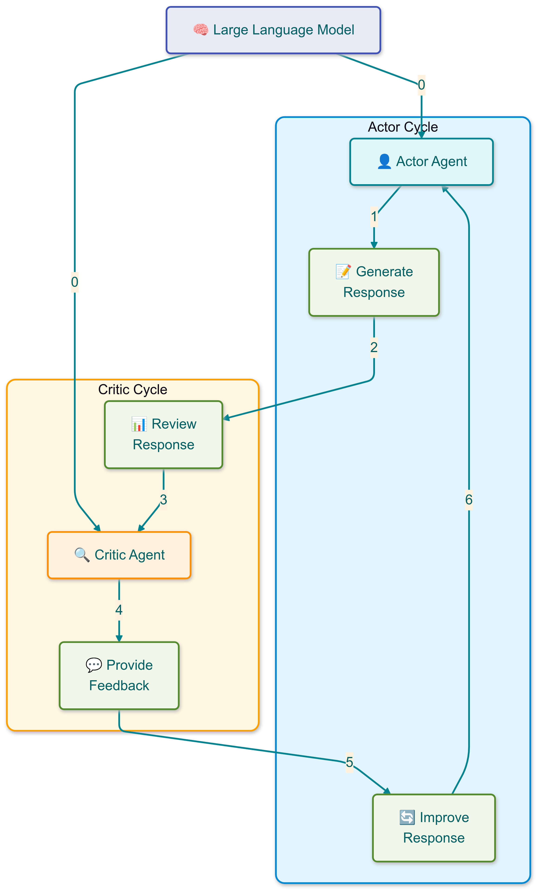
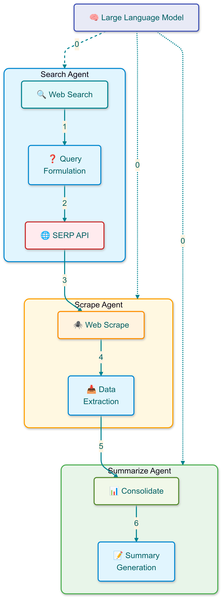
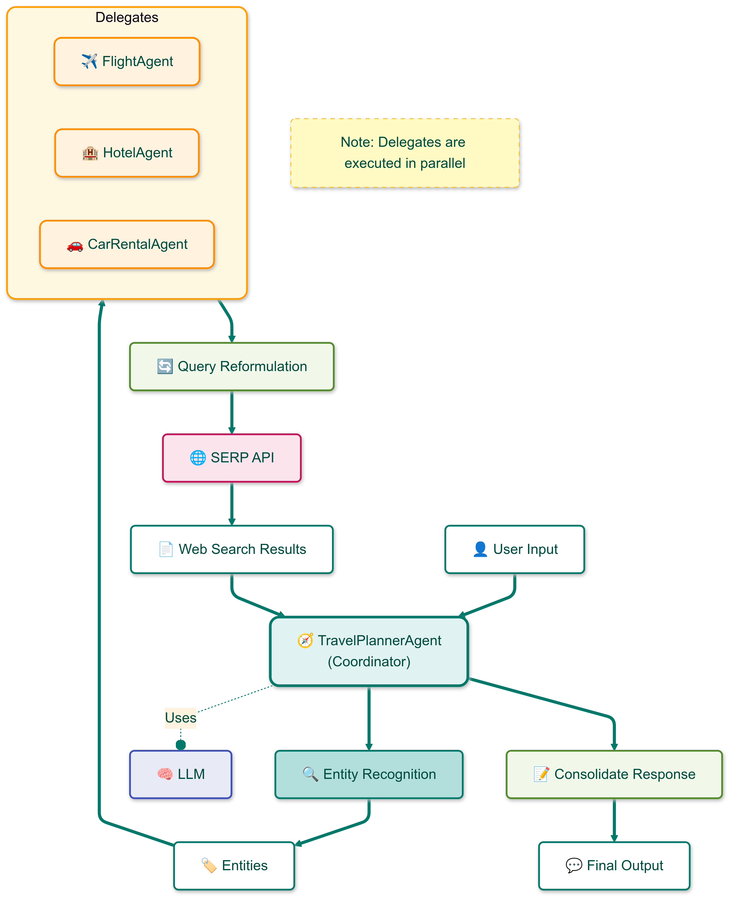
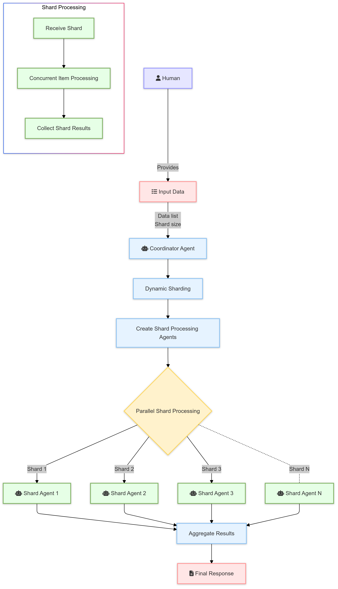
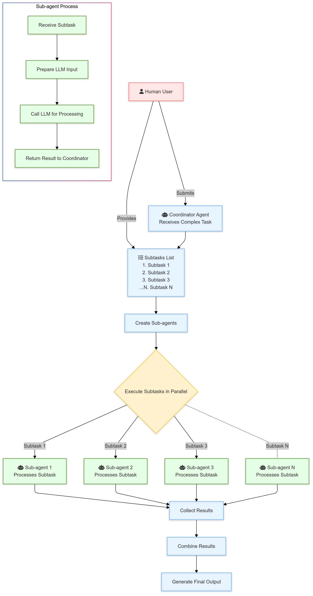
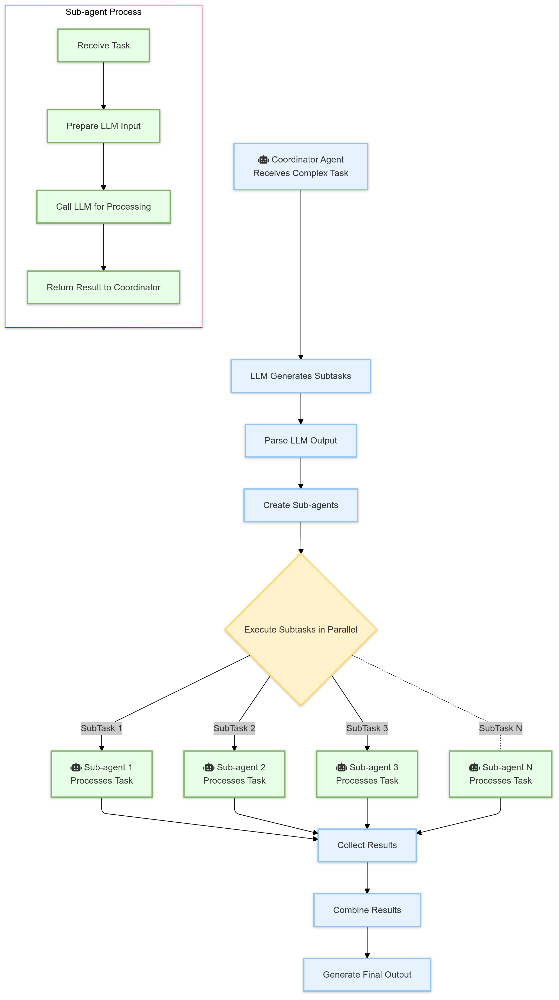

# My Agentic Workflow Patterns 🤖

*Agentic Workflow Patterns* is a repository showcasing best practices and design patterns for building multi-agent and agentic workflows in Python. This repository emphasizes modular, scalable, and reusable design techniques, aiming to facilitate intelligent automation and robust workflow management through both single-agent and collaborative multi-agent architectures. This repository is accompanied by a Medium article that deep dives into the patterns in depth more: [Designing Cognitive Architectures: Agentic Workflow Patterns from Scratch](https://medium.com/google-cloud/designing-cognitive-architectures-agentic-workflow-patterns-from-scratch-63baa74c54bc)


## Table of Contents
- [Overview](#overview)
- [Patterns Overview](#patterns-overview)
- [Getting Started](#getting-started)
- [Installation](#installation)
- [Environment Setup](#environment-setup)
- [Usage](#usage)
- [Project Structure](#project-structure)
- [Contributing](#contributing)
- [License](#license)

## Overview 📜
This repository provides examples and templates for designing agentic workflows, which are workflows composed of self-contained agents, each responsible for distinct tasks. The focus is on creating reusable components that can be adapted for various automation tasks, enabling intelligent decision-making and streamlined processing.

## Patterns Overview 💡

### Pattern 1 - Reflection
The **Reflection** pattern implements an iterative content generation and refinement system using an Actor-Critic framework. This pattern enables self-improving content generation through continuous feedback loops between an Actor (content generator) and a Critic (content reviewer).

🔗 **All code for this pattern can be found [here](https://github.com/arunpshankar/Agentic-Workflow-Patterns/tree/main/src/patterns/reflection)**.

<p align="center">
    
</p>

### Pattern 2 - Web Access 
The **Web Access** pattern implements an agentic workflow for retrieving, processing, and summarizing web content. It orchestrates a pipeline of specialized agents handling different aspects of web content acquisition and processing through search, scrape, and summarize operations.

🔗 **All code for this pattern can be found [here](https://github.com/arunpshankar/Agentic-Workflow-Patterns/tree/main/src/patterns/web_access)**.

<p align="center">
    
</p>

### Pattern 3 - Semantic Routing 
The **Semantic Routing** pattern implements an agentic workflow for intelligently routing user queries to specialized agents based on semantic intent. This pattern uses a coordinator-delegate architecture where a main TravelPlannerAgent determines the user's intent and routes requests to specialized sub-agents for specific travel-related tasks like flight booking, hotel searches, and car rentals.

🔗 **All code for this pattern can be found [here](https://github.com/arunpshankar/Agentic-Workflow-Patterns/tree/main/src/patterns/semantic_router)**.

<p align="center">
    
</p>

### Pattern 4 - Parallel Delegation 
The **Parallel Delegation** pattern processes complex queries by identifying distinct entities through Named Entity Recognition (NER) and delegating these entities to specialized agents for parallel processing. It’s effective for scenarios where independent sub-tasks can be executed concurrently.

🔗 **All code for this pattern can be found [here](https://github.com/arunpshankar/Agentic-Workflow-Patterns/tree/main/src/patterns/parallel_delegation)**.

<p align="center">
    
</p>

### Pattern 5 - Dynamic Sharding 
The **Dynamic Sharding Pattern** efficiently processes large datasets by dynamically dividing the workload into smaller, manageable shards and processing them in parallel. This pattern is demonstrated by fetching biographies of celebrities using web search (discussed in Pattern 2).

🔗 **All code for this pattern can be found [here](https://github.com/arunpshankar/Agentic-Workflow-Patterns/tree/main/src/patterns/dynamic_sharding)**.

<p align="center">
    
</p>

### Pattern 6 - Task Decomposition 
The **Task Decomposition** pattern divides a complex task into independent subtasks, each managed by separate Sub-Task Agents. This pattern is beneficial for enhancing efficiency and scalability.

🔗 **All code for this pattern can be found [here](https://github.com/arunpshankar/Agentic-Workflow-Patterns/tree/main/src/patterns/task_decomposition)**.

<p align="center">
    
</p>

### Pattern 7 - Dynamic Decomposition 
The **Dynamic Decomposition** pattern autonomously decomposes complex tasks into multiple subtasks using a Large Language Model (LLM) to generate subtasks, processed by separate agents.

🔗 **All code for this pattern can be found [here](https://github.com/arunpshankar/Agentic-Workflow-Patterns/tree/main/src/patterns/dynamic_decomposition)**.

<p align="center">
    
</p>

### Pattern 8 - DAG Orchestration 
The **DAG (Directed Acyclic Graph) Orchestration Pattern** manages complex workflows in a flexible manner, allowing for the execution of multiple tasks in a specified order. It uses a YAML-defined DAG to structure the workflow.

🔗 **All code for this pattern can be found [here](https://github.com/arunpshankar/Agentic-Workflow-Patterns/tree/main/src/patterns/dag_orchestration)**.

<p align="center">
    
</p>

## Getting Started 🚀
Clone this repository to get started. This project requires Python 3.8 or later.

### Prerequisites
- [Python 3.8+](https://www.python.org/downloads/)
- `pip` (comes with Python 3.8+)

## Installation 🛠️
1. **Clone the repository:**
   ```bash
   git clone https://github.com/arunpshankar/Agentic-Workflow-Patterns.git
   cd Agentic-Workflow-Patterns
   ```

2. Set up a virtual environment:
   ```bash
   python -m venv .venv
   source .venv/bin/activate  # On Windows, use `.venv\Scripts\activate`
   ```

3. **Upgrade pip and install dependencies:**
   ```bash
   pip install --upgrade pip
   pip install -r requirements.txt
   ```

### Setting up Credentials 🔑
1. Create a `credentials` folder in the project root:
   ```bash
   mkdir credentials
   ```

2. Set up GCP service account credentials:
   - Go to the Google Cloud Console (https://console.cloud.google.com/).
   - Create or select an existing project.
   - Navigate to "APIs & Services" > "Credentials".
   - Click "Create Credentials" > "Service Account Key".
   - Choose JSON as the key type, and click "Create".
   - Save the downloaded JSON file as `key.json` in the `credentials` folder.

3. Set up SERP API credentials:
   - Sign up for a SERP API account at https://serpapi.com/.
   - Obtain your API key from the dashboard.
   - Create a file named `key.yml` in the `credentials` folder.
   - Add your SERP API token:
     ```yaml
     serp:
       key: your_serp_api_key_here
     ```

*Note*: The `credentials` folder is included in `.gitignore` to prevent sensitive information from being committed.

## Environment Setup 🌍
To maintain a clean environment and disable Python bytecode generation, configure the following environment variables:

```bash
export PYTHONDONTWRITEBYTECODE=1
export PYTHONPATH=$PYTHONPATH:.
```

## Project Structure 📂
- **`./src/patterns/`** - Contains all source code for the workflow patterns.
- **`./data/patterns/`** - Contains templates for system and user prompts, JSON schemas for structured outputs, and the outputs (final and intermediate) of the agents.

## Usage 📚
After setting up the environment, you can start experimenting with the workflow patterns included in this repository. Each pattern is documented with examples to demonstrate its application in building agentic workflows.

For example, to run the Reflection pattern:
```bash
python src/patterns/reflection/pipeline.py
```

## Contributing 🤝
We welcome and appreciate contributions! Here’s how to contribute to **Agentic Workflow Patterns**:

1. **Fork the Repository**: Create your own fork on GitHub to make changes independently.
2. **Create a Branch**: Work on a separate branch for each feature or fix.
   ```bash
   git checkout -b feature-branch-name
   ```
3. **Make Changes**: Keep the code style consistent and ensure your changes are well-documented.
4. **Commit Your Changes**: Write a clear and concise commit message.
   ```bash
   git commit -m "Add feature or fix description"
   ```
5. **Submit a Pull Request**: Push your changes and open a pull request.

### Guidelines
- **Coding Style**: Follow existing code conventions.
- **Documentation**: Ensure your code and contributions are well-documented.
- **Testing**:

 Add tests if applicable to maintain repository stability.
- **Issue Reporting**: Report bugs or suggest features via issues.

## License 📜
This repository is licensed under the MIT License. See the [LICENSE](LICENSE) file for details.
