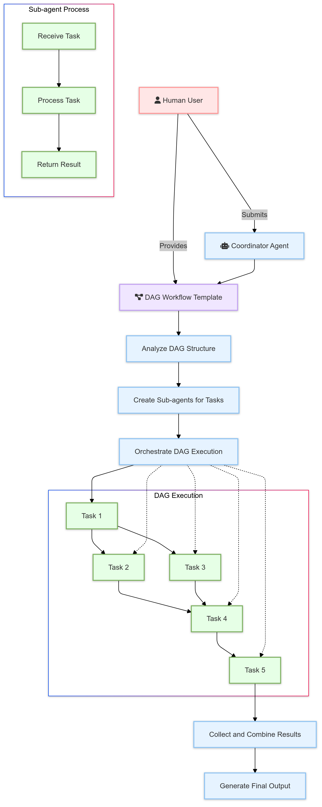

# Pattern 8 - DAG Orchestration Pattern

## Overview

The DAG (Directed Acyclic Graph) Orchestration Pattern is an advanced design pattern for managing complex workflows in a flexible and efficient manner. This pattern allows for the execution of multiple tasks in a specified order, with support for both parallel and serial task execution. The pattern uses a YAML-defined DAG to structure the workflow and a CoordinatorAgent to manage the execution.

    

## Key Components

1. **CoordinatorAgent**: Manages the execution of the entire DAG, creating and running sub-agents as needed.
2. **CollectAgent**: Gathers documents from a specified folder and prepares them for processing.
3. **PreprocessAgent**: Cleans and normalizes the collected document content using a Language Model (LLM).
4. **ExtractAgent**: Extracts key information (characters, themes, plot points) from the preprocessed documents using an LLM.
5. **SummarizeAgent**: Generates concise summaries of the preprocessed documents using an LLM.
6. **CompileAgent**: Compiles a final report based on the extracted key information and summaries.

## Process Flow

1. **DAG Definition Loading**:
   - The CoordinatorAgent reads and parses the YAML file containing the DAG definition.
   - The DAG structure, including tasks, their dependencies, and associated agents, is loaded into memory.

2. **Task Execution Preparation**:
   - The CoordinatorAgent initializes the task states and prepares a list of pending tasks.

3. **Iterative Task Execution**:
   - The CoordinatorAgent enters a loop that continues until all tasks are completed:
     a. **Identify Executable Tasks**:
        - The coordinator scans the pending tasks to find those with all dependencies satisfied.
     b. **Parallel Task Execution**:
        - For each executable task:
          - The appropriate sub-agent is dynamically created based on the task definition.
          - Input data is collected from the results of dependent tasks.
          - The task is submitted for asynchronous execution.
     c. **Wait for Task Completion**:
        - The coordinator waits for all submitted tasks to complete.
     d. **Result Collection and State Update**:
        - As tasks complete, their results are stored and task states are updated.
     e. **Error Handling**:
        - Any task failures are logged, and the overall process can continue if non-critical.

4. **Final Output Generation**:
   - Once all tasks are completed, the coordinator identifies the final task in the DAG.
   - The result of this final task is prepared as the output of the entire workflow.

5. **Cleanup and Reporting**:
   - The coordinator performs any necessary cleanup operations.
   - A final report or summary of the workflow execution may be generated.

Throughout this process, the CoordinatorAgent manages the flow of data between tasks, ensures proper sequencing based on the DAG structure, and handles any errors or exceptions that occur during execution.
