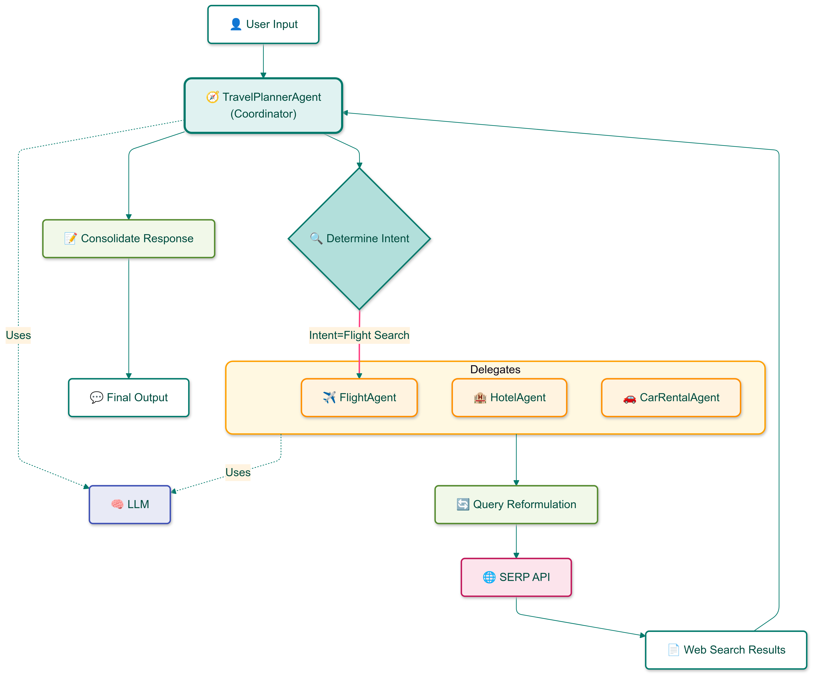

# Pattern 3 - Semantic Router

## Overview

The **Semantic Routing** pattern implements an intelligent workflow for directing user queries to specialized agents based on intent analysis. At its core, this pattern employs a coordinator-delegate architecture, where a primary TravelPlannerAgent acts as the central orchestrator.

The key idea lies in how the coordinator leverages Large Language Models (specifically Gemini Pro) to derive user intent and make precise routing decisions. Rather than activating multiple sub-agents, the coordinator selects and fires only the most appropriate specialized agent for each task. In the travel domain, these specialized agents handle specific functions like flight booking, hotel searches, and car rentals.

Once selected, the sub-agent uses Gemini Pro to reformulate the original user query into a web-search optimized format. This reformulation is crucial as all sub-agents in this pattern utilize the web access pipeline established in Pattern 2, allowing them to retrieve real-time information through structured web searches. For example, a hotel booking query might be reformulated to include specific parameters like location, dates, and amenities that optimize web search results.

The routing agent performs two crucial functions: First, it conducts intent classification to determine the nature of the user's request. Then, after the selected sub-agent completes its task, the routing agent consolidates the output into a coherent final response. Both the coordinator and the specialized sub-agents are powered by Gemini Pro, ensuring consistent natural language understanding and generation throughout the workflow.

This architecture ensures that each user request is handled with precision by the most qualified specialized agent, creating an efficient and focused processing pipeline. Instead of engaging multiple agents simultaneously, the system maintains simplicity and efficiency by activating only the most relevant agent for each specific task.

    

## Key Components

### TravelPlannerAgent (Coordinator)
- Determines user intent through semantic analysis
- Routes queries to appropriate specialized agents
- Manages communication between sub-agents
- Consolidates and formats final responses
- Handles intent classification into categories:
  - FLIGHT
  - HOTEL
  - CAR_RENTAL
  - UNKNOWN

### Specialized Sub-Agents
- **FlightSearchAgent**
  - Processes flight-related queries
  - Generates optimized flight search parameters
  - Returns summarized flight information

- **HotelSearchAgent**
  - Handles hotel booking queries
  - Processes accommodation requests
  - Returns relevant hotel information

- **CarRentalSearchAgent**
  - Manages car rental inquiries
  - Processes vehicle rental requests
  - Returns car rental options and details

### Pipeline
- Orchestrates the entire workflow
- Initializes all agents
- Manages message flow
- Handles both single and batch query processing

## Process Flow

1. **Query Reception**
   - User submits a travel-related query
   - Pipeline creates a message object
   - Query is forwarded to TravelPlannerAgent

2. **Intent Detection**
   - TravelPlannerAgent analyzes query semantics
   - Determines specific travel intent
   - Routes to appropriate specialized agent

3. **Specialized Processing**
   - Sub-agent receives routed query
   - Generates optimized web search query
   - Processes and summarizes results
   - Returns formatted response

4. **Response Consolidation**
   - TravelPlannerAgent receives sub-agent response
   - Consolidates information
   - Formats final user-friendly response
   - Returns completed result
