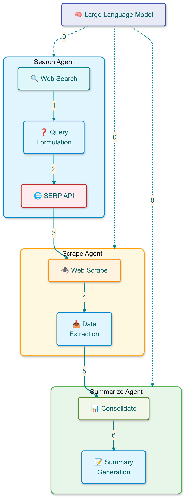

# Pattern 2 - Web Access

## Overview

The **Web Access** pattern implements an agentic workflow for retrieving, processing, and summarizing web content. This pattern orchestrates a pipeline of specialized agents that handle different aspects of web content acquisition and processing through search, scrape, and summarize operations. It leverages the SERP API for web searches and language models for generating queries and summaries.

<p align="center">
    
</p>

## Key Components

### WebSearchAgent
- Orchestrates search operations using language models
- Generates optimized search queries from user input
- Interfaces with SERP API for web searches
- Saves structured search results for further processing

### WebScrapeAgent
- Handles concurrent content extraction from search results
- Implements rate-limited scraping to respect server limits
- Processes and cleans extracted content
- Saves structured content for summarization

### WebContentSummarizeAgent
- Processes scraped content using language models
- Generates concise content summaries
- Uses templated prompts for consistent output
- Produces final summarized results

### Pipeline
- Coordinates execution of all agents
- Manages data flow between components
- Handles cleanup and error recovery
- Provides simple interface for workflow execution

## Process Flow

1. **Search Phase**
   - User query is received by the pipeline
   - WebSearchAgent generates optimized search instructions
   - SERP API returns search results
   - Results are saved for scraping

2. **Scrape Phase**
   - WebScrapeAgent loads search results
   - Content is extracted from web pages concurrently
   - Extracted content is cleaned and processed
   - Structured content is saved for summarization

3. **Summarize Phase**
   - WebContentSummarizeAgent loads scraped content
   - Language model generates content summary
   - Final summary is saved and returned
   - Pipeline completes execution

The entire process can be executed with a single function call:
```python
from src.patterns.web_access.pipeline import run

summary = run("search query", model_name="gemini-1.5-flash-001")
```